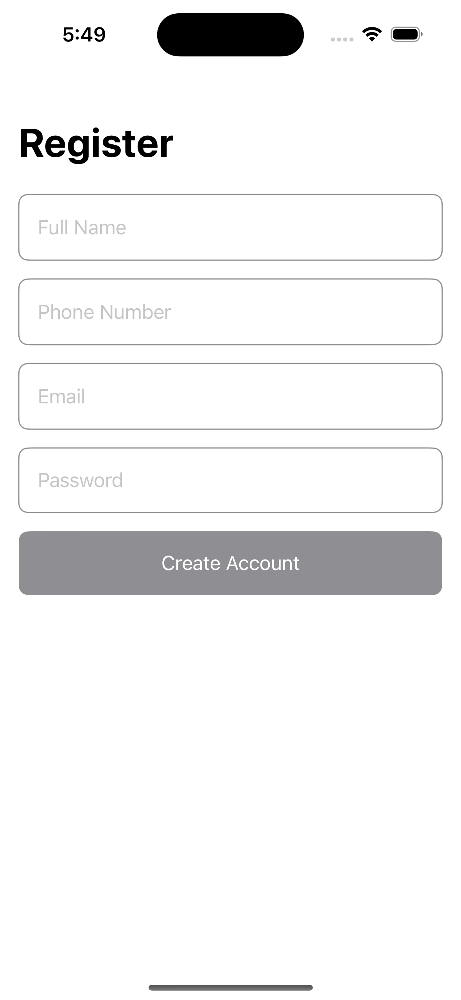
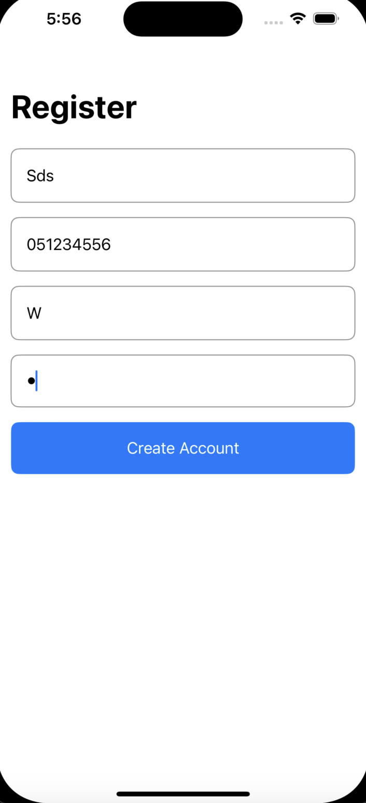
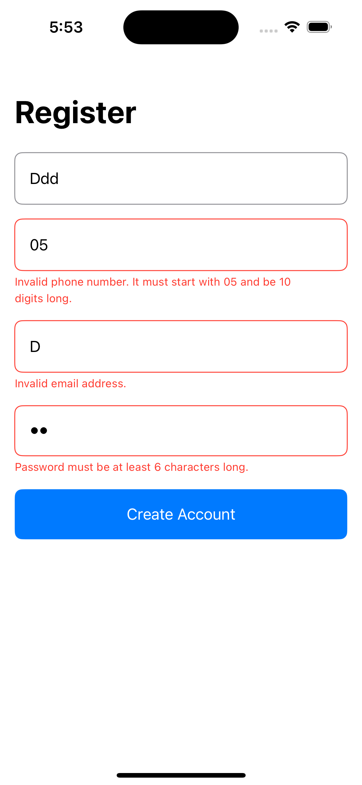

# RegistrationTutorial

A simple registration form built with SwiftUI.

## Features

- Full Name field (accepts only a-z characters)
- Phone Number field (accepts only numeric digits, must start with 05 and be 10 digits long)
- Email field (validates email format)
- Password field (must be at least 6 characters long)
- Real-time validation for enabling/disabling the Create Account button
- Error messages displayed upon form submission if validation fails
- Success popup upon successful registration

## Screenshots

### Base Screen and Button Enabled
<p float="left">
  
  
</p>

### Error Screen and Success Popup
<p float="left">
  
  
</p>

## Installation

1. Clone the repository
   ```sh
   git clone git@github.com:akramhusseini/RegistrationTutorial.git
